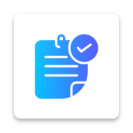
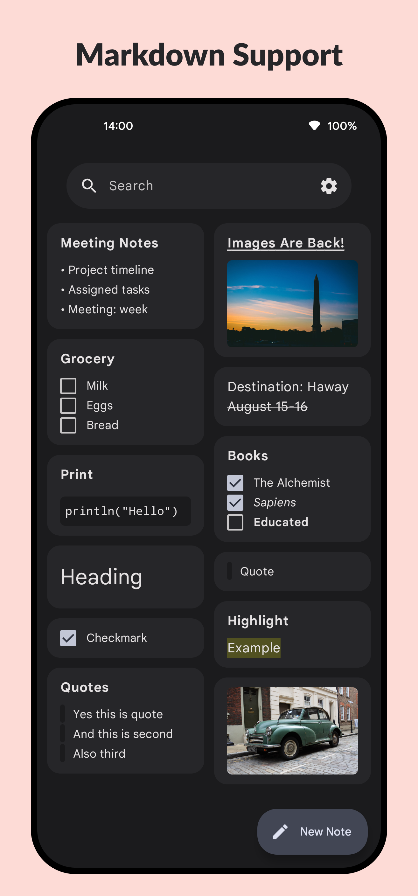
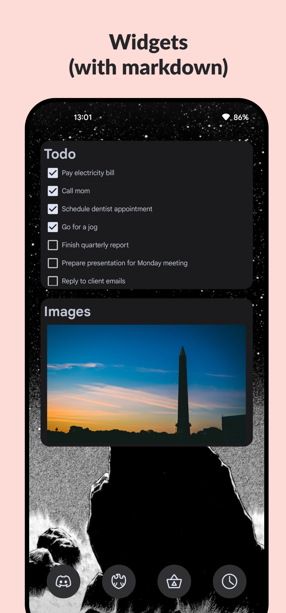
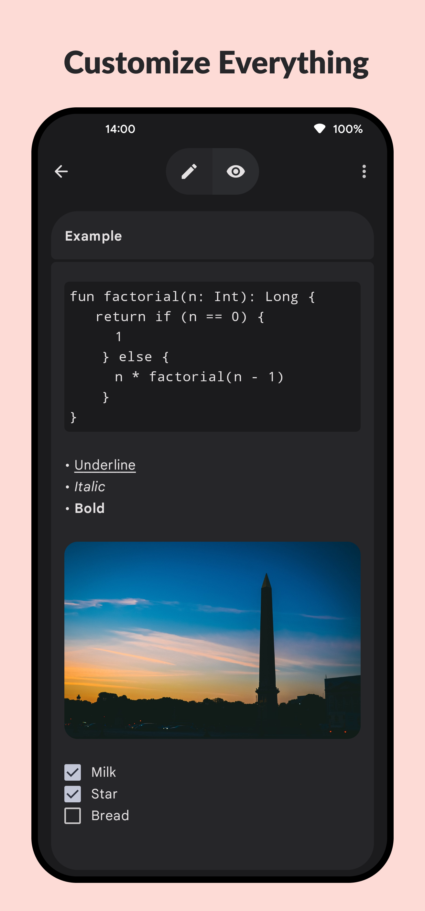

# Azokle Notes

**Lightweight Android notes app with Material You design.**

 &nbsp; 
 &nbsp;
 &nbsp;

---

    
    
    

--- 

## 📢 News
- ! [Applock Hotfix](https://github.com/azoklesoftware/azokle-notes-android/releases/download/Nightly/AzokleNotes-nightly.apk) !
- [Images Support Back!](https://github.com/azoklesoftware/azokle-notes-android/discussions/29)

## 🎉 Features
- 📝 **Sleek, Minimalistic Design**: Built with Google's Material You for a modern look and feel.
- 🌟 **Full Markdown Support**: Easily format your notes, including full image support.
- 🔒 **Secure, Encrypted Vault**: Keep your sensitive notes safe and locked.
- 🚀 **Constant Updates**: Actively maintained by the Azokle software team.
- 🔐 **Zero Permissions Required**: We respect your privacy. No unnecessary permissions.

## 🤝 Community & Contributing

We welcome contributions from the community! Before getting started, please review the following guidelines:

- [Code of Conduct](CODE_OF_CONDUCT.md): Our pledge to maintain a healthy and welcoming community.
- [Contributing Guidelines](CONTRIBUTING.md): Instructions on how to set up the project and submit pull requests.
- [Security Policy](SECURITY.md): Information on supported versions and how to responsibly report vulnerabilities.

## 💬 Contact Us

- **Company**: Azokle Private Limited
- **Website**: [azokle.com](https://azokle.com)
- **Email**: support@azokle.com

## ⚠️ License

    Azokle Notes
    Copyright (c) 2024 Azokle Private Limited
    
    This program is free software: you can redistribute it and/or modify
    it under the terms of the GNU General Public License as published by
    the Free Software Foundation, either version 3 of the License, or
    (at your option) any later version.
    
    This program is distributed in the hope that it will be useful,
    but WITHOUT ANY WARRANTY; without even the implied warranty of
    MERCHANTABILITY or FITNESS FOR A PARTICULAR PURPOSE. See the
    GNU General Public License for more details.
    
    The above copyright notice, this permission notice, and its license shall be included in all copies or substantial portions of the Software.
    
    You can find a copy of the GNU General Public License v3 [here](https://www.gnu.org/licenses/).
